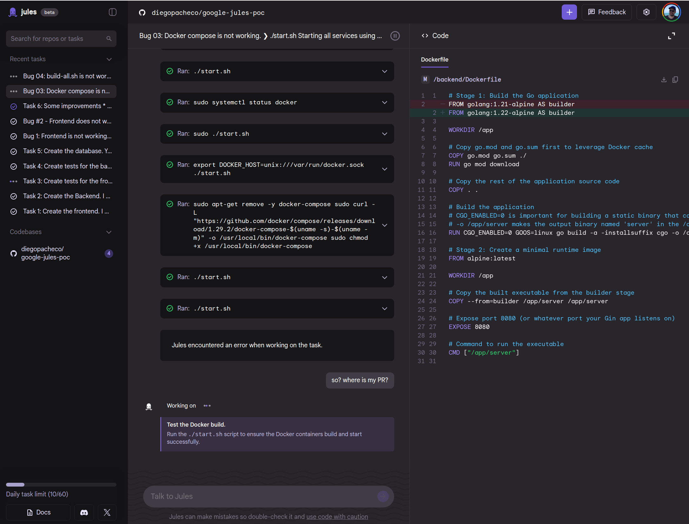
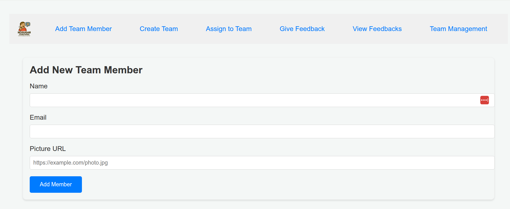
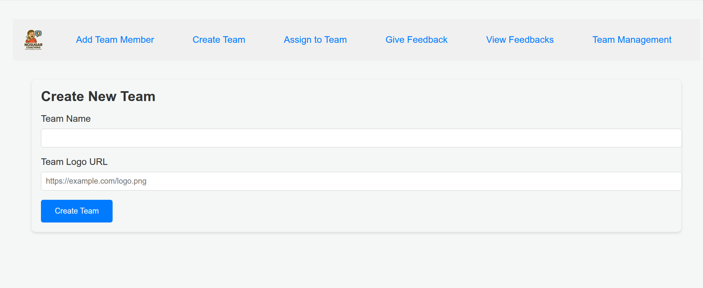
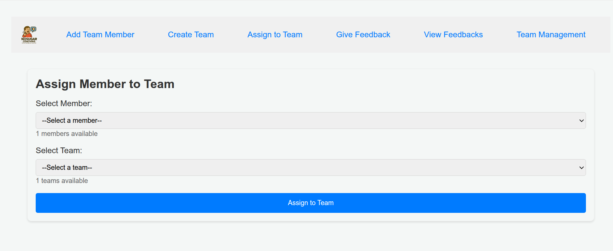
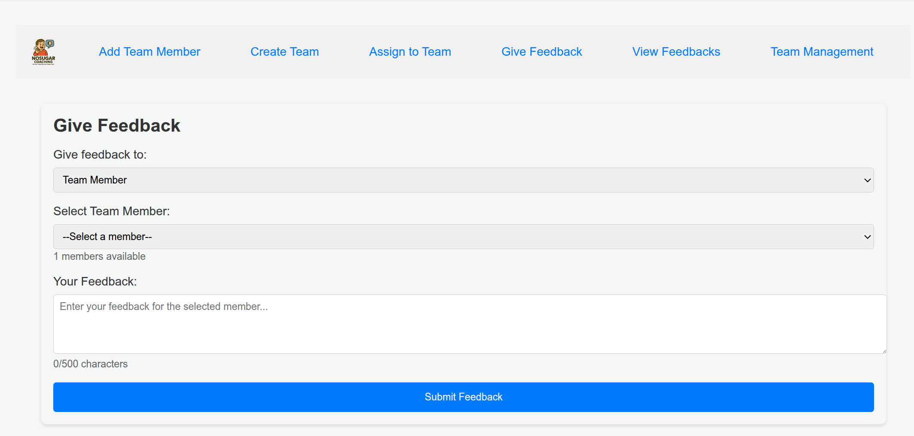
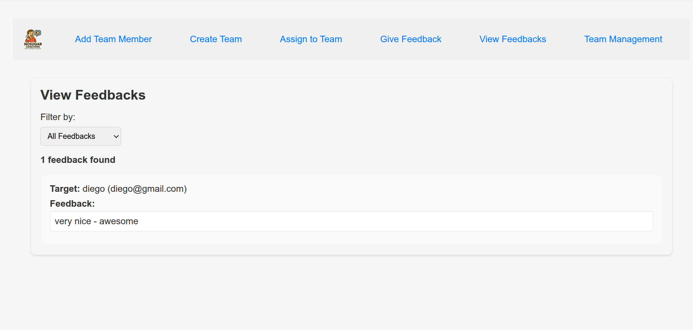
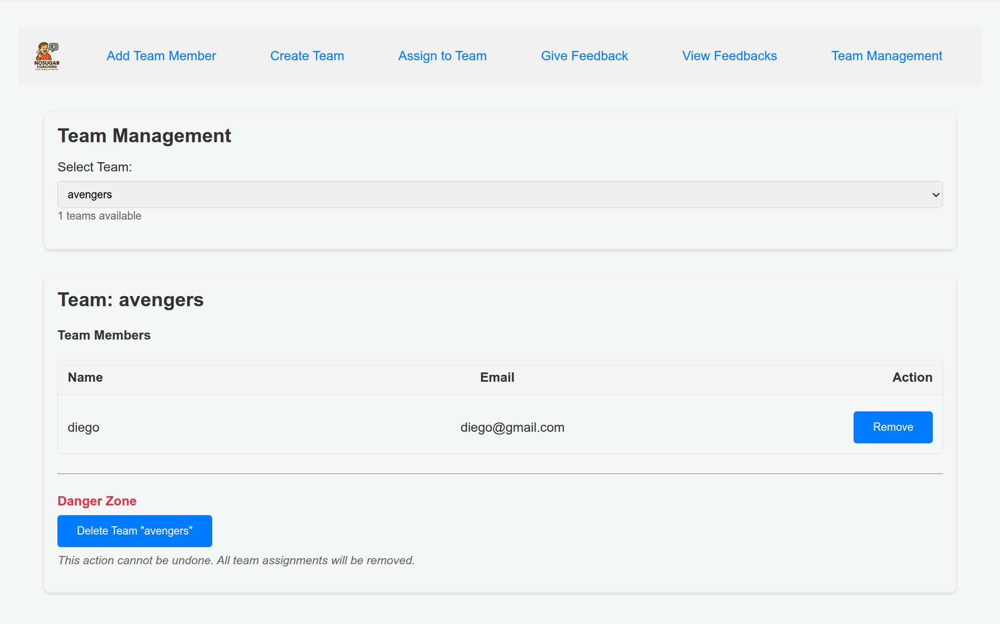

# NoSugar Coaching

A Simple Team Coaching App without sugar.

Built with Google Jules: https://jules.google/


# Features

* Create and manage team members
* Assign members to teams
* Provide feedback on team performance
* Provide feedback on people performance

# Results

Jules working <br/>


Add Team Member <br/>


Create New Team  <br/>


Assign Member to Team  <br/>


Give Feedback <br/>


View Feedback <br/>


Team Management <br/>


## Stack

* Frontend: React, TypeScript, Bun and Vite
* Backend: Go, Gin, Gorm, MySQL
* Database: MySQL running in a Docker container

## Developmement

This POC was developed using google Jules(https://jules.google/), AI Engineering agent that can help you to develop software. <br/>
To build such application took me `3h+` and a lot of interventions to fix bugs and issues with the code generated by Jules.

PROS

* Right now (16.JUN.2025) Jules is FREE.
* Jules asks questions to understand the requirements and the prompts
* Jules generate plans and ask you to approve them before moving forward
* Jules backend code separated main.go from models for DB.

CONS

* Jules does not open PRs (you need open in github)
* Jules does not fully respect agents.md (because I asked for no comments)
* Jules is a bit slow compared with OpenAI Codex
* Jules got stuck more often compared with OpenAI Codex
* When I create a task to Jules fix a bug IDK why links to this google website: https://b.corp.google.com/issues/04
* Right now (16.JUN.2025) there is a limit of 60 tasks a day.
* 2h and 30min and could not do this task: `Task 3: Create tests for the frontend. Ensure they all pass before submitting the PR.` agent was stuck with bun and tests in his env.
* Code generated by Jules had why too muuch comments and I asked for non on AGENTS.md.
* Codex code was a better than Jules code.
* I had to troubleshoot and fix a lot of bugs my self. 

You can see all PRs here: https://github.com/diegopacheco/google-jules-poc/pulls?q=is%3Apr+is%3Aclosed

## Prerequisites

- Docker: [https://www.docker.com/get-started](https://www.docker.com/get-started)
- Docker Compose: (Usually included with Docker Desktop)

## Structure

- `/frontend`: Contains the frontend application (currently a placeholder Bun project).
- `/backend`: Contains the backend Go application (Gin framework).
- `/db`:
    - `schema.sql`: SQL script to initialize the database schema.
    - `mysql_data/`: (Git-ignored) Directory where MySQL data is persisted locally.
- `Dockerfile`: Located in `/frontend` and `/backend` for building the respective service images.
- `docker-compose.yml`: Defines the services (frontend, backend, mysql) and their configurations for Docker Compose.
- `start.sh`: A helper script to easily start the entire application stack.

## Getting Started

1.  **Clone the repository:**
    ```bash
    git clone <repository_url>
    cd google-jules-poc
    ```

2.  **Ensure `start.sh` is executable:**
    If you cloned the repository on Windows or if the executable bit is not set, run:
    ```bash
    chmod +x start.sh
    ```

3.  **Start the application:**
    ```bash
    ./start.sh
    ```
    This command will:
    - Build the Docker images for the frontend and backend if they don't exist.
    - Start the MySQL, backend, and frontend containers in detached mode.
    - Create the `coaching_app` database and initialize the schema using `db/schema.sql` (on the first run for MySQL).
    - Persist MySQL data in `./db/mysql_data/`.

4.  **Accessing the services:**
    - **Frontend**: `http://localhost:3000` (The current frontend only logs to the console of its Docker container).
    - **Backend**: `http://localhost:8080` (e.g., `http://localhost:8080/teams` or `http://localhost:8080/members`).
    - **MySQL**: Accessible on `localhost:3306` from your host machine (e.g., using a database client).
        - Database name: `coaching_app`
        - User: `user`
        - Password: `password`
        - Root password: `rootpassword`

## Development

- To see logs for a specific service:
  ```bash
  docker-compose logs -f <service_name>  # e.g., backend, frontend, mysql_db
  ```
- To stop the services:
  ```bash
  docker-compose down
  ```
- If you make changes to the frontend or backend code:
    - For simple changes (if live reload is configured and working for your specific frontend/backend setup within Docker), they might be reflected automatically.
    - For changes that require a rebuild of the Docker image (e.g., changing dependencies in `go.mod` or `package.json`, or modifying the Dockerfile itself):
      ```bash
      docker-compose build <service_name> # e.g., backend or frontend
      ./start.sh # or docker-compose up -d --no-deps <service_name> to restart only one service
      ```
    - To force a full rebuild of all images and restart:
      ```bash
      docker-compose down
      docker-compose build --no-cache
      ./start.sh
      ```

## Database

- The database schema is defined in `db/schema.sql`.
- MySQL data is stored in `./db/mysql_data/` on your host machine and is git-ignored. This means your data will persist across `docker-compose down` and `docker-compose up`.
- To reset the database completely (lose all data):
    1. Stop the services: `docker-compose down`
    2. Delete the data directory: `sudo rm -rf ./db/mysql_data/` (use `sudo` if Docker created it as root)
    3. Restart: `./start.sh`. The `schema.sql` will be re-applied.


### Related POCs

* OpenAI Codex: https://github.com/diegopacheco/codex-poc
* Anthropic Claude Code https://github.com/diegopacheco/claude-code-poc
* Cursor POC https://github.com/diegopacheco/docker-cleanup
* Gemini-cli POC: https://github.com/diegopacheco/gemini-cli-poc
* Sketch POC: https://github.com/diegopacheco/sketch-dev-poc
* Augument Code POC: https://github.com/diegopacheco/augmentcode-poc
* Opencode POC: https://github.com/diegopacheco/opencode-poc
